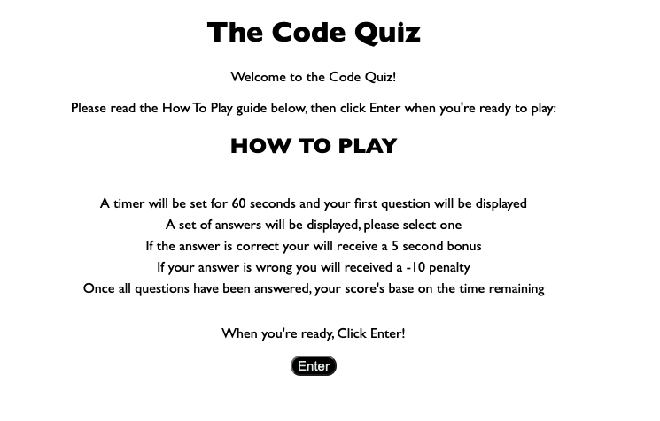
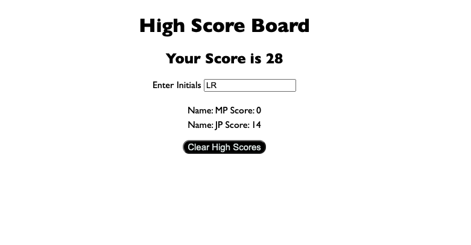
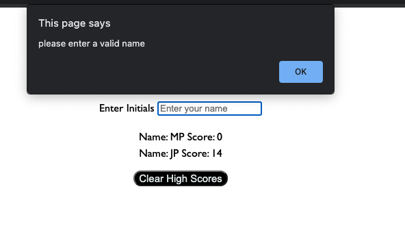

# Code Quiz

AS A coding boot camp student
I WANT to take a timed quiz on JavaScript fundamentals that stores high scores
SO THAT I can gauge my progress compared to my peers

# Acceptance Criteria

GIVEN I am taking a code quiz

WHEN I click the start button
THEN a timer starts and I am presented with a question

WHEN I answer a question
THEN I am presented with another question

WHEN I answer a question incorrectly
THEN time is subtracted from the clock

WHEN all questions are answered or the timer reaches 0
THEN the game is over

WHEN the game is over
THEN I can save my initials and my score

# Features

## Welcome Page

Welcomes user and outlines the quiz rules. Enter button to direct user to quiz page.

## Quiz Page

Start button to start quiz. Once clicked starts timer and quiz feature that displays questions.

## High Score Screen

Once the quiz is complete, this screen displays the users score and also displays previous high scores.

This screen also validates that the user entered a name or initials, if not, notifies the user with an alert.

# Link to Git Hub

https://github.com/mp2626/code_quiz

# Link to Site

https://mp2626.github.io/code_quiz/

# Programming Languages

* HTML
* CSS
* JavaScript

# Authors
Contributor - Michael Perrin